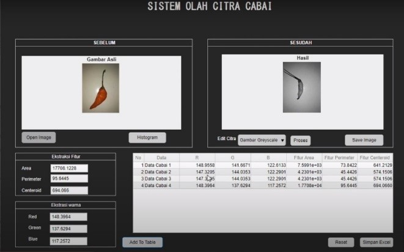
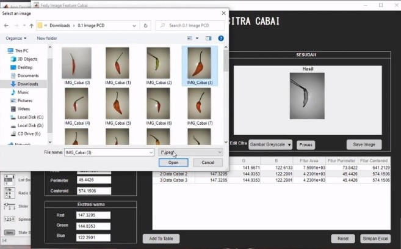

 

  <b><h1 align="center">SISTEM OLAH CITRA CABAI</h1></b>
  <b><align="center">Digital Image Processing System Using Matlab</b> 

 

  <a href="https://github.com/fedyrahmatullah/PCD-Cabai">Repository ini</a> adalah repository yang berisi Project Digital Image Processing System menggunakan Matlab, yaitu "Sistem Olah Citra Cabai".

  

  Link Video on Youtube:  
  [<a href="https://youtu.be/2ehRQA5RSm0">Link Video 1</a>] 
  [<a href="https://youtu.be/bugc08HHdCg">Link Video 2</a>] 

  Sistem olah data citra atau image processing menggunakan Matlab dengan object cabai. Pada sistem ini terdapat fitur untuk mengedit citra menjadi gambar biner, gambar grayscale, maupun deteksi tepi, ada juga fitur untuk menampilkan histogram pada gambar asli beserta data dari ekstraksi fitur dan ekstraksi warna. Data tersebut dapat dianalisis untuk mengetahui tingkat kematangan buah cabai.

 

  

 

 Berikut tampilan aplikasinya:  

 

  

 

  
</p
